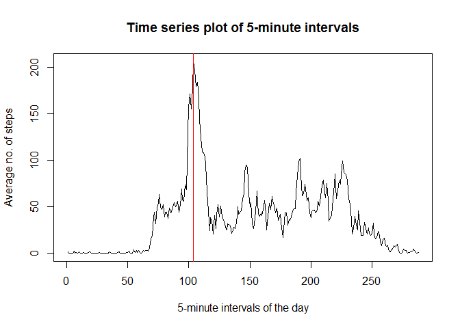
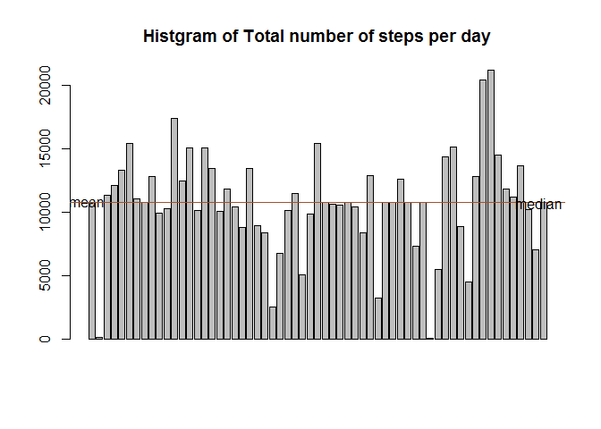

# Project 1 Reproduciable Research
B. Singh Bhail  
January 8, 2017  


```r
setwd("C:\\Users\\avtarsingh\\Downloads\\jhu\\c5")
```


```r
getwd()
```

```
## [1] "C:/Users/avtarsingh/Downloads/jhu/c5"
```

```r
list.files()
```

```
## [1] "activity.csv"              "PA1_template.html"        
## [3] "PA1_template.md"           "PA1_template.Rmd"         
## [5] "PA1_template_files"        "repdata_data_activity.zip"
```


```r
unzip("repdata_data_activity.zip")
```


```r
list.files()
```

```
## [1] "activity.csv"              "PA1_template.html"        
## [3] "PA1_template.md"           "PA1_template.Rmd"         
## [5] "PA1_template_files"        "repdata_data_activity.zip"
```


There is one new file, "activity.csv" unziped from the downloaded zip file.
### I. Loading and preprocessing the data


```r
activity <- read.csv("activity.csv", header = TRUE)
library(dplyr)
```

```
## 
## Attaching package: 'dplyr'
```

```
## The following objects are masked from 'package:stats':
## 
##     filter, lag
```

```
## The following objects are masked from 'package:base':
## 
##     intersect, setdiff, setequal, union
```

```r
library(ggplot2)
library(tidyr)
library(reshape2)
```

```
## 
## Attaching package: 'reshape2'
```

```
## The following object is masked from 'package:tidyr':
## 
##     smiths
```

```r
library(knitr)

head(activity)
```

```
##   steps       date interval
## 1    NA 2012-10-01        0
## 2    NA 2012-10-01        5
## 3    NA 2012-10-01       10
## 4    NA 2012-10-01       15
## 5    NA 2012-10-01       20
## 6    NA 2012-10-01       25
```

```r
tail(activity)
```

```
##       steps       date interval
## 17563    NA 2012-11-30     2330
## 17564    NA 2012-11-30     2335
## 17565    NA 2012-11-30     2340
## 17566    NA 2012-11-30     2345
## 17567    NA 2012-11-30     2350
## 17568    NA 2012-11-30     2355
```

```r
str(activity)
```

```
## 'data.frame':	17568 obs. of  3 variables:
##  $ steps   : int  NA NA NA NA NA NA NA NA NA NA ...
##  $ date    : Factor w/ 61 levels "2012-10-01","2012-10-02",..: 1 1 1 1 1 1 1 1 1 1 ...
##  $ interval: int  0 5 10 15 20 25 30 35 40 45 ...
```
###  Answer I.  Load the data file as activity, and each variable steps, date, interval is in its own column.


### II. What is mean total number of steps taken per day?

1. Calculate the total number of steps taken each day, and make a historgram.
2. Calculate and report the mean and median of the total number of steps taken per day.

```r
        with(activity, barplot(tapply(steps, date, sum, na.rm = TRUE), main = "Histogram of no. of step taken each day", xlab = "Day of the month", ylab = "Total number of steps"))
```

<!-- -->

```r
        activity %>% 
            group_by(date) %>%
            mutate(total = sum(steps, na.rm = TRUE)) %>%
            select(date, total) %>%
            distinct(.keep_all=TRUE) %>%
            ungroup() %>%
            summarise(average.steps.day = mean(total), median.steps.day = median(total))
```

```
## # A tibble: 1 × 2
##   average.steps.day median.steps.day
##               <dbl>            <int>
## 1           9354.23            10395
```

### Answer II. In in the output above, we can see the histogram of total number of steps taken each day.  And second table gives us the average and median steps per day, if we ignore the NA's.


 


### III. What is the average daily activity pattern?
    1. Make a time series plot (i.e. type = "l") of the 5-minute interval (x-axis) and the average number of steps taken, averaged across all days (y-axis)
    2. Which 5-minute interval, on average across all the days in the dataset, contains the maximum number of steps?

```r
        with(activity, plot(tapply(steps, interval, mean, na.rm = TRUE), type = "l", main = "Time series plot of 5-minute intervals", xlab = "5-minute intervals of the day", ylab = "Average no. of steps" ))

        which.max(with(activity, tapply(steps, interval, mean, na.rm = T)))
```

```
## 835 
## 104
```

```r
        (with(activity, tapply(steps, interval, mean, na.rm = T)))[104]
```

```
##      835 
## 206.1698
```

```r
abline(v=104, col= "red")
```

<!-- -->

### Answers III. The 8:35 AM interval on average contains the maximum number of steps. From the above graph and computation, the maxima of average steps is 206.17 during the 8:35 AM interval which is the 104th ordered interval.


### IV. Next question:
1    Calculate and report the total number of missing values in the dataset (i.e. the total number of rows with NAs)
2    Devise a strategy for filling in all of the missing values in the dataset. The strategy does not need to be sophisticated. For example, you could use the mean/median for that day, or the mean for that 5-minute interval, etc.
3    Create a new dataset that is equal to the original dataset but with the missing data filled in.
4    Make a histogram of the total number of steps taken each day and Calculate and report the mean and median total number of steps taken per day. Do these values differ from the estimates from the first part of the assignment? What is the impact of imputing missing data on the estimates of the total daily number of steps?


```r
        table(is.na(activity))
```

```
## 
## FALSE  TRUE 
## 50400  2304
```

```r
        sapply( activity, function(x) table(is.na(x)))
```

```
## $steps
## 
## FALSE  TRUE 
## 15264  2304 
## 
## $date
## 
## FALSE 
## 17568 
## 
## $interval
## 
## FALSE 
## 17568
```

```r
# 1. So 2304 rows have NA values in steps column.

# 2. use mean/median of the '5 minute-ntervals' variable for filling in the NA's.

# Because there are some dates which have all NA valuse for the 'steps' value.

        split.by.date <- split(activity$steps, activity$date)
        sapply(split.by.date, function(x) table(is.na(x)))
```

```
##  2012-10-01.TRUE 2012-10-02.FALSE 2012-10-03.FALSE 2012-10-04.FALSE 
##              288              288              288              288 
## 2012-10-05.FALSE 2012-10-06.FALSE 2012-10-07.FALSE  2012-10-08.TRUE 
##              288              288              288              288 
## 2012-10-09.FALSE 2012-10-10.FALSE 2012-10-11.FALSE 2012-10-12.FALSE 
##              288              288              288              288 
## 2012-10-13.FALSE 2012-10-14.FALSE 2012-10-15.FALSE 2012-10-16.FALSE 
##              288              288              288              288 
## 2012-10-17.FALSE 2012-10-18.FALSE 2012-10-19.FALSE 2012-10-20.FALSE 
##              288              288              288              288 
## 2012-10-21.FALSE 2012-10-22.FALSE 2012-10-23.FALSE 2012-10-24.FALSE 
##              288              288              288              288 
## 2012-10-25.FALSE 2012-10-26.FALSE 2012-10-27.FALSE 2012-10-28.FALSE 
##              288              288              288              288 
## 2012-10-29.FALSE 2012-10-30.FALSE 2012-10-31.FALSE  2012-11-01.TRUE 
##              288              288              288              288 
## 2012-11-02.FALSE 2012-11-03.FALSE  2012-11-04.TRUE 2012-11-05.FALSE 
##              288              288              288              288 
## 2012-11-06.FALSE 2012-11-07.FALSE 2012-11-08.FALSE  2012-11-09.TRUE 
##              288              288              288              288 
##  2012-11-10.TRUE 2012-11-11.FALSE 2012-11-12.FALSE 2012-11-13.FALSE 
##              288              288              288              288 
##  2012-11-14.TRUE 2012-11-15.FALSE 2012-11-16.FALSE 2012-11-17.FALSE 
##              288              288              288              288 
## 2012-11-18.FALSE 2012-11-19.FALSE 2012-11-20.FALSE 2012-11-21.FALSE 
##              288              288              288              288 
## 2012-11-22.FALSE 2012-11-23.FALSE 2012-11-24.FALSE 2012-11-25.FALSE 
##              288              288              288              288 
## 2012-11-26.FALSE 2012-11-27.FALSE 2012-11-28.FALSE 2012-11-29.FALSE 
##              288              288              288              288 
##  2012-11-30.TRUE 
##              288
```

```r
# We see that october 1, 8 and November 1,4,9,10,14,30 are the dates where all the observations of 'steps' are NA, therefore it does not make sense to use mean/median of that day

        with(activity, sapply(split(activity$steps, activity$interval), function(x) table(is.na(x))))
```

```
##        0  5 10 15 20 25 30 35 40 45 50 55 100 105 110 115 120 125 130 135
## FALSE 53 53 53 53 53 53 53 53 53 53 53 53  53  53  53  53  53  53  53  53
## TRUE   8  8  8  8  8  8  8  8  8  8  8  8   8   8   8   8   8   8   8   8
##       140 145 150 155 200 205 210 215 220 225 230 235 240 245 250 255 300
## FALSE  53  53  53  53  53  53  53  53  53  53  53  53  53  53  53  53  53
## TRUE    8   8   8   8   8   8   8   8   8   8   8   8   8   8   8   8   8
##       305 310 315 320 325 330 335 340 345 350 355 400 405 410 415 420 425
## FALSE  53  53  53  53  53  53  53  53  53  53  53  53  53  53  53  53  53
## TRUE    8   8   8   8   8   8   8   8   8   8   8   8   8   8   8   8   8
##       430 435 440 445 450 455 500 505 510 515 520 525 530 535 540 545 550
## FALSE  53  53  53  53  53  53  53  53  53  53  53  53  53  53  53  53  53
## TRUE    8   8   8   8   8   8   8   8   8   8   8   8   8   8   8   8   8
##       555 600 605 610 615 620 625 630 635 640 645 650 655 700 705 710 715
## FALSE  53  53  53  53  53  53  53  53  53  53  53  53  53  53  53  53  53
## TRUE    8   8   8   8   8   8   8   8   8   8   8   8   8   8   8   8   8
##       720 725 730 735 740 745 750 755 800 805 810 815 820 825 830 835 840
## FALSE  53  53  53  53  53  53  53  53  53  53  53  53  53  53  53  53  53
## TRUE    8   8   8   8   8   8   8   8   8   8   8   8   8   8   8   8   8
##       845 850 855 900 905 910 915 920 925 930 935 940 945 950 955 1000
## FALSE  53  53  53  53  53  53  53  53  53  53  53  53  53  53  53   53
## TRUE    8   8   8   8   8   8   8   8   8   8   8   8   8   8   8    8
##       1005 1010 1015 1020 1025 1030 1035 1040 1045 1050 1055 1100 1105
## FALSE   53   53   53   53   53   53   53   53   53   53   53   53   53
## TRUE     8    8    8    8    8    8    8    8    8    8    8    8    8
##       1110 1115 1120 1125 1130 1135 1140 1145 1150 1155 1200 1205 1210
## FALSE   53   53   53   53   53   53   53   53   53   53   53   53   53
## TRUE     8    8    8    8    8    8    8    8    8    8    8    8    8
##       1215 1220 1225 1230 1235 1240 1245 1250 1255 1300 1305 1310 1315
## FALSE   53   53   53   53   53   53   53   53   53   53   53   53   53
## TRUE     8    8    8    8    8    8    8    8    8    8    8    8    8
##       1320 1325 1330 1335 1340 1345 1350 1355 1400 1405 1410 1415 1420
## FALSE   53   53   53   53   53   53   53   53   53   53   53   53   53
## TRUE     8    8    8    8    8    8    8    8    8    8    8    8    8
##       1425 1430 1435 1440 1445 1450 1455 1500 1505 1510 1515 1520 1525
## FALSE   53   53   53   53   53   53   53   53   53   53   53   53   53
## TRUE     8    8    8    8    8    8    8    8    8    8    8    8    8
##       1530 1535 1540 1545 1550 1555 1600 1605 1610 1615 1620 1625 1630
## FALSE   53   53   53   53   53   53   53   53   53   53   53   53   53
## TRUE     8    8    8    8    8    8    8    8    8    8    8    8    8
##       1635 1640 1645 1650 1655 1700 1705 1710 1715 1720 1725 1730 1735
## FALSE   53   53   53   53   53   53   53   53   53   53   53   53   53
## TRUE     8    8    8    8    8    8    8    8    8    8    8    8    8
##       1740 1745 1750 1755 1800 1805 1810 1815 1820 1825 1830 1835 1840
## FALSE   53   53   53   53   53   53   53   53   53   53   53   53   53
## TRUE     8    8    8    8    8    8    8    8    8    8    8    8    8
##       1845 1850 1855 1900 1905 1910 1915 1920 1925 1930 1935 1940 1945
## FALSE   53   53   53   53   53   53   53   53   53   53   53   53   53
## TRUE     8    8    8    8    8    8    8    8    8    8    8    8    8
##       1950 1955 2000 2005 2010 2015 2020 2025 2030 2035 2040 2045 2050
## FALSE   53   53   53   53   53   53   53   53   53   53   53   53   53
## TRUE     8    8    8    8    8    8    8    8    8    8    8    8    8
##       2055 2100 2105 2110 2115 2120 2125 2130 2135 2140 2145 2150 2155
## FALSE   53   53   53   53   53   53   53   53   53   53   53   53   53
## TRUE     8    8    8    8    8    8    8    8    8    8    8    8    8
##       2200 2205 2210 2215 2220 2225 2230 2235 2240 2245 2250 2255 2300
## FALSE   53   53   53   53   53   53   53   53   53   53   53   53   53
## TRUE     8    8    8    8    8    8    8    8    8    8    8    8    8
##       2305 2310 2315 2320 2325 2330 2335 2340 2345 2350 2355
## FALSE   53   53   53   53   53   53   53   53   53   53   53
## TRUE     8    8    8    8    8    8    8    8    8    8    8
```

```r
# Here we see that we can use the mean value of each 5-minute interval to fill in the NA's of 'steps' column, becaue there are only 8 NA's for each 'interval' group as seen above.

# 3. create a new dataframe with all the corresponding NA's in steps column.

        activity.new <- activity %>%
                        group_by(interval) %>%
                        mutate(fill.in.mean = mean(steps, na.rm = TRUE)) %>%
                        mutate(steps.fixed = ifelse(is.na(steps), fill.in.mean, steps)) %>%
                        select(steps, date, interval, steps.fixed)

# 4. Histogram of total steps taken each day.  Mean and median of number of steps per day. Compare the effect of imputed missing values.
        with(activity.new, barplot(tapply(steps.fixed, date, sum), main = " Total number of steps taken each day", xlab = "Date", ylab = "Avg. no. steps"))
```

<!-- -->

```r
        new.central.measure <- activity.new %>%
                                    group_by(date) %>%
                                         mutate(total = sum(steps.fixed)) %>%
                                            select(date, total) %>%
                                                distinct(.keep_all = TRUE) %>%
                                                    ungroup() %>%
                                                        summarise(mean = mean(total), median = median(total))
                                
            
        new.central.measure # print the results
```

```
## # A tibble: 1 × 2
##       mean   median
##      <dbl>    <dbl>
## 1 10766.19 10766.19
```

```r
# The new mean and median are both 10766.18
        
# I want to make sure my calculations are not wrong, first I will want to see the summary of the 'steps.fixed' column used in the new calculations.  I will redo the calculations with base R
            
    

        
        
        
        
        
#  note: using -Standard Base R evaluations- below and get a histogram of total steps and mean and median:

second.total.steps <- aggregate(activity.new[4], activity.new[2], sum)
kable(second.total.steps, format = "markdown")
```


|date       | steps.fixed|
|:----------|-----------:|
|2012-10-01 |    10766.19|
|2012-10-02 |      126.00|
|2012-10-03 |    11352.00|
|2012-10-04 |    12116.00|
|2012-10-05 |    13294.00|
|2012-10-06 |    15420.00|
|2012-10-07 |    11015.00|
|2012-10-08 |    10766.19|
|2012-10-09 |    12811.00|
|2012-10-10 |     9900.00|
|2012-10-11 |    10304.00|
|2012-10-12 |    17382.00|
|2012-10-13 |    12426.00|
|2012-10-14 |    15098.00|
|2012-10-15 |    10139.00|
|2012-10-16 |    15084.00|
|2012-10-17 |    13452.00|
|2012-10-18 |    10056.00|
|2012-10-19 |    11829.00|
|2012-10-20 |    10395.00|
|2012-10-21 |     8821.00|
|2012-10-22 |    13460.00|
|2012-10-23 |     8918.00|
|2012-10-24 |     8355.00|
|2012-10-25 |     2492.00|
|2012-10-26 |     6778.00|
|2012-10-27 |    10119.00|
|2012-10-28 |    11458.00|
|2012-10-29 |     5018.00|
|2012-10-30 |     9819.00|
|2012-10-31 |    15414.00|
|2012-11-01 |    10766.19|
|2012-11-02 |    10600.00|
|2012-11-03 |    10571.00|
|2012-11-04 |    10766.19|
|2012-11-05 |    10439.00|
|2012-11-06 |     8334.00|
|2012-11-07 |    12883.00|
|2012-11-08 |     3219.00|
|2012-11-09 |    10766.19|
|2012-11-10 |    10766.19|
|2012-11-11 |    12608.00|
|2012-11-12 |    10765.00|
|2012-11-13 |     7336.00|
|2012-11-14 |    10766.19|
|2012-11-15 |       41.00|
|2012-11-16 |     5441.00|
|2012-11-17 |    14339.00|
|2012-11-18 |    15110.00|
|2012-11-19 |     8841.00|
|2012-11-20 |     4472.00|
|2012-11-21 |    12787.00|
|2012-11-22 |    20427.00|
|2012-11-23 |    21194.00|
|2012-11-24 |    14478.00|
|2012-11-25 |    11834.00|
|2012-11-26 |    11162.00|
|2012-11-27 |    13646.00|
|2012-11-28 |    10183.00|
|2012-11-29 |     7047.00|
|2012-11-30 |    10766.19|

```r
summary(second.total.steps)
```

```
##          date     steps.fixed   
##  2012-10-01: 1   Min.   :   41  
##  2012-10-02: 1   1st Qu.: 9819  
##  2012-10-03: 1   Median :10766  
##  2012-10-04: 1   Mean   :10766  
##  2012-10-05: 1   3rd Qu.:12811  
##  2012-10-06: 1   Max.   :21194  
##  (Other)   :55
```

```r
with(second.total.steps, barplot(steps.fixed, main = "Histgram of Total number of steps per day"))
abline(h = mean(second.total.steps$steps.fixed), col= "yellow")
text(x= 0, y = mean(second.total.steps$steps.fixed), label="mean")
abline(h = median(second.total.steps$steps), col = "sienna")
text(x = 72, y = median(second.total.steps$steps), label = "median")
```

<!-- -->


### Answer IV. There were 2304 NA's in the 'step' column.  I use the mean over 5-minute interval values to fill in the missing values and created a new dataset `activity.new`. 

Next the I calculated the mean and median, both are 10766 steps per day. I chech this by making a data frame of total steps per day in new data frame, stored as 'second.total.steps'.  This time I use the aggregate() to split the steps by date and calculate the total steps, these results are stored as a data frame in `second.total.steps`.  If we sum the daily total steps, the sum equals 656737.5 and divide this by 61 day in the dataset and we verify the average of 10766.19.  The median is also correct and one could use the `sort(second.total.steps$steps.fixed)[31]` to verify that.


### V.  Are there differences in activity patterns between weekdays and weekends?

For this part the weekdays() function may be of some help here. Use the dataset with the filled-in missing values for this part.

    1. Create a new factor variable in the dataset with two levels - "weekday" and "weekend" indicating whether a given date is a weekday or weekend day.
    2. Make a panel plot containing a time series plot (i.e. type = "l") of the 5-minute interval (x-axis) and the average number of steps taken, averaged across all weekday days or weekend days (y-axis). See the README file in the GitHub repository to see an example of what this plot should look like using simulated data.
    

```r
        activity.new <- mutate(activity.new, day = ifelse(weekdays(as.Date(date)) %in% c("Saturday", "Sunday"), "weekend", "weekday"))

        
        use <- activity.new %>%
            group_by(interval, day) %>%
            mutate(mean_by.interval = mean(steps.fixed)) %>%
            ungroup()%>%
            select(interval, day, mean_by.interval) %>%
            distinct(.keep_all = TRUE)
        
        # now use has 576 rows, 288 that give weekday 5-minute interval mean and 288 that give weekend values.  
        
        ggplot(use, aes( x= interval, y = mean_by.interval)) + facet_grid(day~.) + geom_line() + labs(y= "Average number of steps in an interval", title = "Average number of steps in a 5-minute interval")
```

<!-- -->

### Answer V. To create the new factor variable used, weekdays() and as.Date() to add a new columns to 'activity.new' call it 'day'. Then create the panel plot.
